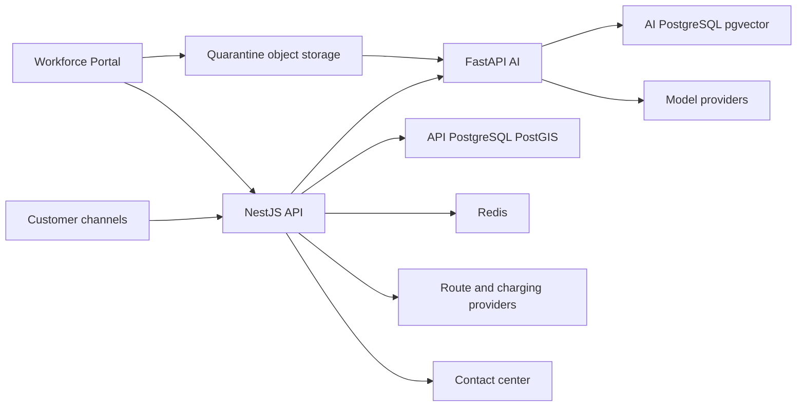

# Threat model cho Customer AI Assistant và EV Journey Planner

## Executive summary

Rủi ro cao nhất nằm ở việc vượt object authorization qua conversation/tool,
nhiễm độc knowledge làm phát tán thông tin sai, thực thi đề xuất AI không còn
đúng scope, và dùng dữ liệu route/trạm/tariff cũ hoặc bất thường để tạo kế hoạch
không an toàn. Kiến trúc giảm blast radius bằng cách giữ NestJS làm business
authority, FastAPI là private execution runtime, tool chỉ trả typed proposal,
knowledge release có maker-checker và planner deterministic. Đây là baseline
cho implementation/staging; residual risk vẫn cần human Security, Privacy, Data,
Product và Release Owner chấp nhận trước production.

## Scope and assumptions

In scope:

- `backend/api/src/modules/engagement`
- `backend/api/src/modules/mobility`
- `backend/ai/app/modules/assistant`
- `backend/ai/app/modules/knowledge`
- `backend/ai/app/modules/inference`
- Customer/Workforce Portal surfaces liên quan chat, trip và Knowledge Hub.
- PostgreSQL/PostGIS, AI PostgreSQL/pgvector, Redis, object storage, Pub/Sub,
  Keycloak, route/charging/model providers và contact-center adapter.

Out of scope:

- Live vehicle navigation, in-drive rerouting và vehicle telemetry.
- Payment, booking hoặc tool AI có side effect.
- Production cloud topology chưa có environment/vendor contract được duyệt.
- CI/developer agents không được coi là runtime của Customer Assistant.

Assumptions đã được Product/Architecture plan khóa:

- Customer surfaces Internet-facing; Workforce yêu cầu workforce OIDC/MFA.
- Việt Nam là market đầu tiên, VI/EN và global-ready.
- GCP-first nhưng provider nằm sau adapter.
- V1 chỉ có text, read-only tool, citation/refusal/handoff và pre-trip planning.
- Dữ liệu giá, chính sách, xe, trạm và tariff chỉ có authority khi source,
  revision, effective time và freshness còn hợp lệ.
- Customer chat không trở thành training data mặc định.

Delivery sequencing hiện tại:

- Customer AI Assistant là scope implementation đang mở.
- EV Journey Planner chỉ giữ kiến trúc/threat evidence ở trạng thái future;
  không có writer, provider credential, migration hoặc production exposure cho
  tới khi Chatbot staging acceptance hoàn tất.

Open questions trước production:

- Named contact-center/V-GREEN/CSMS provider và contract retention thực tế.
- Data residency, RTO/RPO và peak workload theo từng market.
- Google Maps enterprise terms và derived-data use đã được Legal phê duyệt.

## System model

### Primary components

- Customer Portal/Drupal nhận message, file và trip input nhưng không giữ bearer
  token hoặc thực thi authorization.
- NestJS API xác thực, authorize object, kiểm sequence/quota, sở hữu conversation,
  handoff, tool execution và deterministic Mobility policy.
- FastAPI AI nhận signed assertion ngắn hạn, điều phối LangGraph, retrieval,
  inference và trả proposal/evidence; không truy cập API PostgreSQL.
- Workforce Portal điều khiển Knowledge workflow; không gửi file trực tiếp vào
  active index.
- API PostgreSQL và AI PostgreSQL/pgvector là hai authority khác nhau; Redis,
  Pub/Sub và provider response không phải source of truth.

### Data flows and trust boundaries

- Internet → Portal/API: cookie/session, message, route input và attachment qua
  HTTPS; API kiểm identity/profile, object scope, size/rate, schema,
  idempotency và CSRF/origin khi áp dụng.
- NestJS → FastAPI: signed private assertion và minimized context qua private
  HTTP; kiểm issuer, audience, expiry, replay, profile, budget, conversation
  version và allowed revision.
- FastAPI → Model/Embedding provider: prompt/evidence đã minimize qua provider
  adapter; không gửi bearer token, raw VIN hoặc quyền nghiệp vụ.
- FastAPI → AI PostgreSQL/pgvector: checkpoint, chunk, embedding và release
  revision; ACL được lọc trước ranking và kiểm lại trước response.
- FastAPI → NestJS: typed answer/proposal/evidence; NestJS kiểm fencing token,
  schema, authorization, freshness và anomaly trước commit/tool execution.
- Workforce → Knowledge upload: signed upload vào quarantine; malware, PII,
  secret, license và poisoning scan trước parse/index.
- NestJS → Route/Charging providers: allowlisted request với quota/field mask;
  response được schema/freshness/anomaly validate trước planner.
- NestJS → Customer: durable event/SSE; không stream chain-of-thought, raw tool
  payload, prompt hoặc provider error.

#### Diagram

## Assets and security objectives

| Asset | Why it matters | Security objective |
|---|---|---|
| Customer identity, consent và garage | PII và object scope | C/I/A |
| Conversation, attachment và handoff | Nội dung nhạy cảm, bằng chứng CSKH | C/I/A |
| Knowledge source/revision | Quyết định factual của toàn hệ thống | I/A |
| Prompt, policy, graph và tool registry | Điều khiển hành vi AI | C/I/A |
| Vehicle/charging/tariff projections | Đầu vào planner và tư vấn | I/A |
| Route input và exact location | Có thể suy ra hành vi/home/work | C/I |
| Trip algorithm/profile revisions | Tái lập và giải trình kết quả | I/A |
| Provider/Keycloak credentials | Cho phép truy cập hệ thống đặc quyền | C/I |
| Audit/release evidence | Incident, pháp lý và rollback | I/A |
| Token/cost quota | Chống DoS và chi phí mất kiểm soát | I/A |

## Attacker model

### Capabilities

- Khách anonymous/authenticated có thể gửi message, retry, race request, file và
  route input được chế tác.
- Attacker có thể đánh cắp session phía client, thử IDOR, prompt injection,
  parser bomb, cost exhaustion hoặc lợi dụng provider outage/stale data.
- Workforce account bị compromise có thể upload tài liệu độc hại hoặc đề xuất
  release sai trong phạm vi capability của tài khoản.
- External provider hoặc integration có thể trả dữ liệu malformed, stale,
  contradictory hoặc bị replay.

### Non-capabilities

- Không giả định attacker có quyền production database, signing key hoặc host.
- Không giả định model có quyền trực tiếp mutation business state.
- Không coi operator hợp lệ là attacker toàn quyền; insider risk được giới hạn
  theo capability, scope và maker-checker.

## Entry points and attack surfaces

| Surface | How reached | Trust boundary | Notes | Evidence |
|---|---|---|---|---|
| Chat session/message | Public `/api/v1` | Internet → API | Object scope, inbox/OCC | `backend/api/src/modules/engagement/presentation` |
| AI private answer | Private `/internal/v1` | API → AI | Signed assertion bắt buộc | `backend/ai/app/modules/assistant/presentation/router.py` |
| Knowledge upload/webhook | Workforce/API | Operator/provider → quarantine | File/parser/rights risk | `backend/ai/docs/knowledge-ingestion.md` |
| Retrieval | Private AI | AI → pgvector | ACL/poisoning/cross-profile | `backend/ai/docs/knowledge-release.md` |
| Tool proposal | Private AI | AI → API | Output là untrusted | `backend/api/docs/ai-gateway-and-tools.md` |
| Trip planning | Public API | Internet → Mobility | Location/privacy/cost risk | `backend/api/src/modules/mobility` |
| Route/charging adapter | Server outbound | API → provider | SSRF/schema/stale/terms | `docs/decisions/0007-ev-route-and-charging-planner.md` |
| SSE event stream | Public API | API → client | Cursor/replay/data leak | `backend/api/docs/conversation-runtime.md` |
| Handoff | API/contact center | API → workforce integration | Offline state/PII | `backend/api/docs/conversation-runtime.md` |

## Top abuse paths

1. Attacker lấy session ID của người khác → thử đọc event/messages → nếu object
   authorization chỉ kiểm bearer token mà không kiểm owner thì lộ conversation.
2. Attacker gửi nhiều message đồng thời → các turn ghi đè checkpoint/result →
   output của turn cũ được commit vào state mới.
3. Workforce account upload PDF có indirect prompt injection → candidate vượt
   scan/review → retrieval phát instruction độc hại cho mọi customer.
4. Model sinh tool proposal với customer/resource khác → API tin proposal →
   cross-customer data bị đọc hoặc mutation ngoài scope.
5. Provider trả giá/trạm/tariff bất thường hoặc stale → planner tin dữ liệu →
   khách nhận điểm dừng/chi phí không đáng tin.
6. Attacker gửi PDF/image bomb hoặc prompt cực dài → worker/model cạn RAM/token →
   làm gián đoạn service và tăng chi phí.
7. Attacker replay signed assertion hoặc response muộn → AI result cũ vượt qua
   cancellation → làm sai conversation hoặc trip state.
8. Exact origin/destination bị ghi vào log/analytics → dữ liệu di chuyển bị truy
   cập ngoài purpose hoặc không xóa được qua DSAR.

## Threat model table

| Threat ID | Threat source | Prerequisites | Threat action | Impact | Impacted assets | Existing controls (evidence) | Gaps | Recommended mitigations | Detection ideas | Likelihood | Impact severity | Priority |
|---|---|---|---|---|---|---|---|---|---|---|---|---|
| TM-001 | Remote customer | Biết/đoán identifier hoặc đánh cắp client state | IDOR conversation, handoff hoặc trip | Cross-customer PII leakage | Identity, conversation, location | Object scope requirement (`backend/api/docs/conversation-runtime.md`) | Public capability và endpoint coverage chưa E2E đầy đủ | Kiểm issuer+subject+profile+object ở application service; capability hash; negative E2E | Cross-subject denial metric và audit reason | Medium | High | High |
| TM-002 | Remote customer/network retry | Gửi message đồng thời hoặc response muộn | Race checkpoint/final answer | Corrupt state, trả lời sai ngữ cảnh | Conversation, checkpoint | Inbox/OCC/fencing design (`backend/api/docs/conversation-runtime.md`) | Persistence/transport chưa hoàn chỉnh | Một active turn; monotonic sequence; lease/fencing; late-result discard | OCC conflict, stale fence và queue-depth alerts | High | High | High |
| TM-003 | Malicious document/insider | Có source create/update capability | Poison active knowledge | Sai policy/giá/safety ở quy mô lớn | Knowledge, customer trust | Quarantine và maker-checker design (`backend/ai/docs/knowledge-release.md`) | Bounded parser và release evidence chưa active | Signed source, scan, candidate index, independent approval, atomic activation, kill switch | Poison canary, citation drift và source anomaly | Medium | High | High |
| TM-004 | Prompt/model/provider | AI proposal được API tin quá mức | Đổi scope/tool/resource hoặc chèn output | Data leak, unauthorized action | Customer data, tools | Proposal-only boundary (`backend/api/docs/ai-gateway-and-tools.md`) | Tool registry/runtime enforcement chưa hoàn chỉnh | JSON Schema, allowlist, object auth, anomaly check; V1 read-only; handoff không là tool | Denied proposal metric và schema fingerprint | Medium | High | High |
| TM-005 | Charging/route provider hoặc bad source | Provider response hợp schema nhưng stale/phi lý | Planner dùng trạm/tariff/profile sai | Stranding risk, sai chi phí | Trip result, customer safety | Source/freshness policy (`docs/decisions/0007-ev-route-and-charging-planner.md`) | EVSE normalization/reliability/calibration chưa triển khai | OCPI projection, revision/freshness, anomaly ranges, conservative model, `NO_FEASIBLE_ROUTE` | Stale-source block, reserve violation và provider drift | Medium | High | High |
| TM-006 | Remote customer | Có endpoint upload/message/trip | Resource/token/cost exhaustion | Degraded availability, financial loss | Compute, model quota | Session budget/rate design (`backend/api/docs/conversation-runtime.md`) | Worker memory and queue ceilings chưa active | Size/page/pixel/token limits, bounded workers, per-subject budget, circuit breaker, DLQ | Cost/session, queue saturation, OOM/restart alert | High | Medium | High |
| TM-007 | Replay attacker/compromised integration | Thu được assertion/webhook hoặc delay response | Replay request/result | Duplicate action hoặc stale commit | Conversation, release state | Signed assertion/replay design (`backend/api/docs/ai-gateway-and-tools.md`) | Nonce storage/expiry chưa E2E | Short TTL, audience, nonce, request hash, webhook signature, fencing token | Replay-denial counter và nonce collision | Medium | High | High |
| TM-008 | Internal analytics/log consumer | Exact location được persist ngoài purpose | Re-identify home/work/movement | Privacy breach và DSAR failure | Location, identity | Trip minimization (`backend/api/docs/data-model.md`) | Full lineage/retention not implemented | Encrypt/pseudonymize, short TTL, no raw coordinates in logs, coarse analytics, DSAR adapters | Raw-coordinate scanner và retention breach alert | Medium | High | High |
| TM-009 | Compromised model/provider | Prompt/evidence chứa excess PII/secret | Exfiltrate context hoặc prompt | Confidentiality and provider compliance breach | PII, prompt, credentials | Minimized assertion and no-secret rules (`backend/api/docs/ai-gateway-and-tools.md`) | Provider-specific DLP evidence pending | Data classification filter, prompt allowlist, provider region/retention contract, no secrets in prompt | DLP events và provider payload audit hash | Low | High | Medium |
| TM-010 | Workforce account | Có release capability | Self-approve hoặc bypass revision barrier | Unreviewed knowledge active | Knowledge/release evidence | Maker-checker baseline (`docs/governance/security-data-ai.md`) | Knowledge capability APIs chưa active | Atomic SoD check, step-up MFA, immutable approval evidence, last-known-good rollback | Self-approval denial và unexpected activation | Medium | High | High |

## Criticality calibration

- **Critical:** pre-auth code execution trong parser; signing/provider credential
  theft; cross-market bulk PII exfiltration.
- **High:** cross-customer conversation/location leak; poisoned policy active;
  planner tạo route vi phạm reserve do stale/anomalous source.
- **Medium:** targeted cost exhaustion có rate-limit bypass; provider prompt
  metadata leak không gồm customer PII; telemetry loss làm giảm detection.
- **Low:** public schema/version disclosure; noisy invalid input bị chặn; loss
  of non-critical progress event khi final state vẫn durable.

## Focus paths for security review

| Path | Why it matters | Related Threat IDs |
|---|---|---|
| `backend/api/src/modules/engagement` | Conversation ownership, OCC, SSE và handoff | TM-001, TM-002, TM-006, TM-007 |
| `backend/api/src/modules/mobility` | Location minimization và deterministic plan | TM-005, TM-008 |
| `backend/api/src/modules/access` | Identity/session/authorization authority | TM-001, TM-007 |
| `backend/api/docs/ai-gateway-and-tools.md` | Assertion và tool trust boundary | TM-004, TM-007, TM-009 |
| `backend/ai/app/modules/assistant` | Graph state, retry, checkpoint và output | TM-002, TM-004, TM-007 |
| `backend/ai/app/modules/knowledge` | Source/retrieval/revision boundary | TM-003, TM-010 |
| `backend/ai/app/modules/inference` | Provider minimization, budget, fallback | TM-006, TM-009 |
| `apps/workforce-portal/src/features` | Knowledge approval và capability UX | TM-003, TM-010 |
| `infra/local/keycloak` | Realm/authentication baseline | TM-001 |
| `backend/api/prisma/models` | Retention, relation và scope constraints | TM-001, TM-002, TM-005, TM-008 |

## Notes on use

- Đã bao phủ public/private API, upload/parser, retrieval, tool, provider,
  streaming, handoff, persistence và release boundaries.
- Runtime được tách khỏi CI/agent tooling; agent workflow không được coi là
  runtime mitigation.
- Mọi “existing control” đang ở trạng thái design phải được xác minh bằng code
  và test trước khi đổi thành implemented evidence.
- Risk ranking cần review lại khi có provider contract, production topology,
  peak workload, residency và contact-center integration thật.
