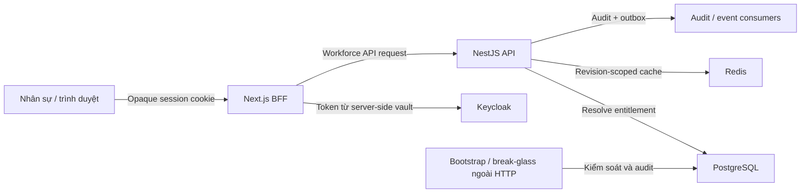

# Threat model cho Workforce Authorization

## Phạm vi và giả định

Phạm vi gồm Workforce Portal, BFF session/token vault, Keycloak workforce realm,
NestJS Access context, PostgreSQL entitlement store, Redis cache và audit/outbox.
Customer Portal, Drupal content authoring và production network topology không
thuộc phạm vi chi tiết của tài liệu này.

Các giả định cần Security Owner xác nhận trước production:

- Workforce Portal chỉ được truy cập qua HTTPS và workload identity giữa các dịch vụ.
- Keycloak thực thi MFA cho workforce; privileged action còn kiểm tra assurance/freshness.
- API PostgreSQL là authority cho business capability; JWT role không phải authority.
- Redis là cache có thể mất; PostgreSQL và deny-by-default vẫn quyết định.
- Audit sink, backup, key management và retention production sẽ có owner riêng.

## Tài sản và mục tiêu bảo mật

| Tài sản | Mục tiêu |
|---|---|
| Workforce identity và BFF session | Không bị chiếm dụng, fixation hoặc replay |
| Capability catalog | Chỉ code/release process được định nghĩa key |
| Role, assignment và organization scope | Toàn vẹn, có version, không tự nâng quyền |
| Approval và maker-checker evidence | Người đề xuất khác người duyệt, không replay |
| Token trong BFF vault | Không xuất hiện trong browser, log hoặc client bundle |
| Audit và entitlement revision | Có thể truy vết, không sửa ngầm |
| Customer/workforce data | Không lộ xuyên market, showroom hoặc department |

## Trust boundary và luồng dữ liệu

Các boundary quan trọng là browser → BFF, BFF → API, API → Keycloak,
API → PostgreSQL/Redis và mutation → audit/outbox.

## Khả năng của tác nhân đe dọa

- Người dùng chưa đăng nhập có thể gửi request trực tiếp đến BFF/API.
- Workforce user hợp lệ có thể sửa client/UI và gọi API ngoài giao diện.
- Workforce user bị chiếm tài khoản có thể thử mở rộng scope hoặc tự approve.
- Internal service hoặc cache có thể trả dữ liệu stale, bị lỗi hoặc bị replay.
- Dependency, CI artifact hoặc capability manifest có thể bị can thiệp.
- Operator có quyền database có thể thử sửa role/audit ngoài application flow.

## Các abuse path ưu tiên

| ID | Abuse path | Tác động | Kiểm soát bắt buộc | Rủi ro còn lại |
|---|---|---|---|---|
| WA-01 | Sửa UI để gọi mutation không có capability | Nâng quyền | NestJS guard + application object policy + default deny | Lỗi gắn decorator/use case mới |
| WA-02 | Dùng entitlement cache cũ sau revoke | Quyền tồn tại ngoài ý muốn | Revision trong cache key, invalidation event, privileged mutation đọc revision mới | Độ trễ event ở action standard |
| WA-03 | Tự gán hoặc tự duyệt privileged role | Toàn quyền hệ thống | Maker-checker, proposer ≠ approver, expiry, step-up MFA | Collusion giữa hai tài khoản |
| WA-04 | Scope showroom/market bị bỏ qua | Lộ hoặc sửa dữ liệu chéo đơn vị | Scope check tại application service trên resource context | Projection tổ chức stale |
| WA-05 | Chiếm BFF session hoặc CSRF | Hành động dưới danh nghĩa nạn nhân | HttpOnly/Secure/SameSite, rotation, CSRF/origin check, no-store | Thiết bị người dùng đã bị kiểm soát |
| WA-06 | Token rò qua browser/log/error | Chiếm identity | Server-only vault, redaction, không localStorage, log test | Lỗi telemetry hoặc debug config |
| WA-07 | Replay mutation/approval | Lặp thay đổi quyền | Idempotency-Key, OCC/If-Match, request expiry, consumed state | Replay ngoài retention window |
| WA-08 | Vô hiệu hóa quản trị viên cuối cùng | Lockout vận hành | Last-admin invariant và break-glass ngoài portal | Break-glass bị quản trị kém |
| WA-09 | Tạo capability tùy ý hoặc wildcard | Bypass mô hình quyền | Versioned code-owned catalog, schema/CI validation | Supply-chain/CI compromise |
| WA-10 | Redis/PostgreSQL hoặc identity provider lỗi | Fail-open hay outage | Redis fallback DB; DB/identity lỗi fail closed; circuit breaker | Mất khả dụng có chủ đích |
| WA-11 | Directory/audit API bị enumeration | Lộ PII và cấu trúc tổ chức | Capability riêng, pagination, field minimization, audit export control | User nội bộ có quyền đọc hợp lệ |
| WA-12 | Sửa database/audit ngoài API | Mất toàn vẹn bằng chứng | DB role separation, append-only audit sink, outbox, alert reconciliation | DBA đặc quyền cần compensating control |

## Yêu cầu xác minh

- Unit/integration test cho default deny, scope, OCC, expiry, maker-checker,
  self-elevation, last-admin và stale revision.
- E2E chứng minh việc sửa UI không vượt qua NestJS.
- Kiểm tra browser bundle/storage không chứa token hoặc capability authority.
- Fault test cho Redis down, invalidation race và PostgreSQL unavailable.
- Secret/PII scan trên log, audit payload và Problem Details.
- Shadow comparison giữa role cũ và capability mới trước cutover.
- Security Owner duyệt residual risk, break-glass runbook và production controls.

## Ngoài phạm vi và điều kiện phát hành

Tài liệu không tự chứng nhận production. Multi-region consistency, organization
directory source, immutable external audit sink, SIEM alert, backup/restore và
break-glass operation phải được thiết kế theo environment thật. Cho tới khi các
owner này xác nhận, authorization platform chỉ ở trạng thái staging foundation.
