# Tóm tắt điều hành

> **Kiến trúc đích, không phản ánh trạng thái triển khai.**

## VFBiz là gì?

VFBiz là nền tảng số ngành ô tô kết nối toàn bộ hành trình từ khám phá sản phẩm,
định danh khách hàng, sở hữu xe và hỗ trợ sau bán hàng đến vận hành nội bộ,
tri thức doanh nghiệp và trải nghiệm di chuyển EV.

VFBiz không phải một website hoặc một chatbot đơn lẻ. Đây là hệ sinh thái gồm:

- Drupal public web cho content, SEO và discovery;
- Customer Portal và mobile cho trải nghiệm đã xác thực;
- Workforce Portal cho nghiệp vụ nhân sự theo capability;
- Keycloak cho authentication, MFA và identity lifecycle;
- API Platform cho business authority, authorization và integration;
- AI Platform cho LangGraph, RAG, model policy và evaluation;
- EV Journey Platform cho tìm trạm và lập kế hoạch hành trình;
- Platform/SRE cho delivery, observability, resilience và cost control.

_Hình 1 — VFBiz kết nối các kênh trải nghiệm với platform và hệ thống doanh
nghiệp thông qua các trust boundary rõ ràng._

## Bài toán cần giải quyết

Khách hàng không nên phải lặp lại thông tin giữa website, portal, mobile và bộ
phận hỗ trợ. Nhân sự không nên thao tác trực tiếp trên database, cloud console
hoặc công cụ kỹ thuật để cập nhật sản phẩm và chính sách. AI không được tự nhớ
giá, chính sách hoặc dữ liệu cá nhân khi các nguồn có thẩm quyền đã tồn tại.

Nền tảng cần đồng thời giải quyết:

- trải nghiệm nhất quán trên nhiều kênh;
- phân quyền customer/workforce và object authorization;
- dữ liệu xe, giá, promotion, ownership và charging có provenance;
- trả lời AI có citation, refusal và handoff;
- cập nhật tri thức có approval, revision và rollback;
- tính hành trình EV bằng thuật toán deterministic;
- khả năng thay provider mà không thay đổi business authority;
- vận hành an toàn khi provider, cache, model hoặc telemetry lỗi.

## Giá trị chiến lược

### Đối với khách hàng

- Một identity và lịch sử tương tác nhất quán.
- Thông tin xe, chính sách và hành trình có nguồn, freshness và giải thích.
- Có thể chuyển từ self-service sang nhân viên mà không mất ngữ cảnh.
- Quản lý consent, session, dữ liệu cá nhân và xe của chính mình.

### Đối với lực lượng vận hành

- Role động được ghép từ capability nhỏ và organizational scope.
- Knowledge Hub cập nhật tài liệu mà không cần truy cập cloud console.
- Maker-checker cho giá, bảo hành, safety, legal và AI release.
- Audit trail giúp truy nguyên ai đã thay đổi gì, dựa trên nguồn nào.

### Đối với doanh nghiệp

- Giảm coupling giữa channel, identity, business state và AI provider.
- Tăng tốc thay đổi nhờ contract và ownership rõ ràng.
- Đo được chất lượng, latency, cost và residual risk theo từng capability.
- Có cơ chế shadow, canary, rollback và kill switch thay vì phát hành mù.

## Nguyên tắc kiến trúc

1. **Authority trước automation:** model và UI không thay business authority.
2. **Evidence trước câu trả lời:** factual claim phải có nguồn hoặc từ chối.
3. **Deterministic cho con số và hành động:** giá, SOC, tariff và transaction
   đến từ code/tool được kiểm soát.
4. **Deny by default:** authentication không đồng nghĩa authorization.
5. **Provider-neutral:** cloud/model chỉ là adapter, không phải domain.
6. **Revision-aware:** data, prompt, policy, model và algorithm đều pin version.
7. **Human accountability:** agent hỗ trợ; con người duyệt product, risk và
   production release.
8. **Progressive delivery:** offline evaluation → shadow → canary → rollout.

## Những điều không được hứa

- Chatbot “không bao giờ sai” hoặc Semantic Firewall chặn 100%.
- Trip Planner chính xác tuyệt đối trong mọi thời tiết và điều kiện xe.
- Capability roadmap đồng nghĩa với runtime đã được triển khai.
- Fine-tuning tự động từ mọi dislike hoặc handoff.
- Sử dụng dữ liệu, logo, bản đồ hoặc dataset khi chưa có quyền hợp lệ.
