# Sản phẩm và trải nghiệm

> **Kiến trúc đích, không phản ánh trạng thái triển khai.**

_Hình 2 — Mỗi kênh phục vụ một audience và không tự trở thành nguồn dữ liệu
hoặc authorization authority._

## Public Experience — Drupal

Drupal sở hữu public SSR, SEO, editorial content, campaign, menu, translation
và media metadata. Đây là bề mặt khám phá công khai, có thể nhúng điểm vào
Chatbot, Trip Planner và lời mời đăng nhập.

Drupal không sở hữu:

- credential, MFA hoặc customer session;
- structured vehicle authority;
- giá/tariff động hoặc inventory;
- customer profile và Garage;
- vector index hoặc AI release.

Content được publish từ Drupal phải đi qua signed webhook và Knowledge Release
workflow trước khi trở thành nguồn RAG active.

## Customer Portal

Customer Portal là Next.js BFF cho khách hàng đã xác thực:

- hồ sơ, locale, timezone, market và preference;
- trạng thái email/MFA và liên kết required action;
- session, revoke và logout-all;
- consent và data request;
- Customer Garage và ownership status;
- Chatbot có customer-scoped read tools;
- điểm vào Lập kế hoạch hành trình EV.

Browser chỉ giữ opaque session cookie. Access/refresh token nằm server-side;
Server DAL gọi API Platform trực tiếp. Portal không nhận password, OTP hoặc
WebAuthn response.

## Mobile

Mobile là native customer experience cho account, Garage, notification,
Chatbot và EV journey. Mobile dùng Authorization Code + PKCE, system browser và
secure native storage; không tái sử dụng web session cookie.

Offline route corridor, live navigation, vehicle telemetry và edge model là
capability tương lai, cần safety program riêng. Mobile không tự trở thành nguồn
chuẩn cho vehicle state hoặc route truth.

## Workforce Portal

Workforce Portal là cổng nội bộ đa vai trò:

- quản trị role, capability, assignment và approval;
- customer support theo object/organizational scope;
- vehicle/catalog/commercial release;
- Knowledge Hub, simulator và AI release evidence;
- audit, incident và operational reconciliation.

UI ẩn hoặc disable action để hỗ trợ UX, nhưng NestJS vẫn kiểm quyền trên mọi
request. Super Admin chỉ ghép capability có trong code-owned catalog; không tự
tạo wildcard hoặc permission string.

## Identity Experience

Keycloak trực tiếp render:

- customer registration, login, recovery, verify email và MFA;
- workforce SSO, login, required action, MFA và passkey;
- email template liên quan identity.

Hai realm được tách:

| Realm             | Audience   | Registration                 |
| ----------------- | ---------- | ---------------------------- |
| `vfbiz-customer`  | Khách hàng | Cho phép theo product policy |
| `vfbiz-workforce` | Nhân sự    | Không self-registration      |

Customer Portal và Workforce Portal khởi tạo OIDC flow nhưng không render
credential form.

## Hành trình liên kết

### Từ khám phá đến hỗ trợ

1. Khách xem nội dung công khai trên Drupal.
2. Khách đăng nhập qua customer realm khi cần dữ liệu cá nhân.
3. Portal gọi API để lấy profile, Garage và approved vehicle facts.
4. Chatbot đọc public/customer-scoped view qua read-only tool.
5. Khi bot không đủ evidence, durable handoff chuyển ngữ cảnh cho nhân viên.

### Từ tài liệu nội bộ đến câu trả lời khách hàng

1. Nhân sự upload tài liệu vào Knowledge Hub.
2. Hệ thống scan, parse, chunk, evaluate và tạo candidate revision.
3. Người có capability phù hợp submit/approve/activate.
4. Retrieval chỉ đọc revision active.
5. Chatbot cite source revision trong câu trả lời.

### Từ xe đến kế hoạch hành trình

1. Khách chọn variant hoặc xe trong Garage.
2. API lấy Vehicle Energy Profile đã duyệt.
3. Planner lấy route và charging projection qua adapter.
4. Deterministic solver tạo các phương án.
5. Customer Portal/Mobile hiển thị uncertainty, freshness và cảnh báo.
