# Kiến trúc hệ thống

> **Kiến trúc đích, không phản ánh trạng thái triển khai.**

## Mô hình ba plane

VFBiz được tổ chức theo ba plane thay vì ép mọi capability vào một chuỗi lớp:

1. **Experience Plane:** Drupal, Customer Portal, Mobile, Workforce Portal và
   Keycloak Identity Experience.
2. **Runtime Data Plane:** API Platform, AI Platform, business contexts,
   retrieval, tools và EV Planner.
3. **Control & Assurance Plane:** workflow quản trị, dataset/prompt release,
   audit, observability, FinOps và human approval.

Security, privacy, data governance và resilience là cross-cutting controls.

_Hình 3 — Clients không gọi AI database hoặc enterprise systems trực tiếp; API
Platform giữ business authority và integration boundary._

## Container responsibilities

| Container              | Trách nhiệm chính                                          | Không sở hữu                          |
| ---------------------- | ---------------------------------------------------------- | ------------------------------------- |
| Drupal                 | Public content, SSR, SEO, editorial workflow               | Customer/business state               |
| Customer Portal        | BFF và customer journeys                                   | Credential, token authority, database |
| Workforce Portal       | BFF và workforce UX                                        | Authorization decision                |
| Mobile                 | Native customer experience                                 | System of record                      |
| Keycloak               | Authentication, MFA, identity session                      | Business role/capability              |
| NestJS API             | `/api/v1`, authorization, business state, orchestration    | Model policy/vector index             |
| FastAPI AI             | LangGraph, retrieval, inference, evaluation, tool proposal | Business mutation                     |
| PostgreSQL/PostGIS     | Operational data/projection theo context                   | Binary/media                          |
| AI PostgreSQL/pgvector | Knowledge/dataset/evaluation artifacts                     | Customer credential                   |
| Redis                  | Cache, lease, short-lived session/token state              | Durable authority                     |
| Object storage         | Source binary, candidate và immutable artifact             | Workflow decision                     |

## Luồng synchronous

Synchronous request được dùng khi caller cần kết quả trực tiếp:

- browser BFF → API Platform;
- API → Keycloak introspection/admin adapter khi policy yêu cầu;
- API → enterprise/provider adapter;
- API → private AI gateway;
- Planner → route/station/weather adapters.

Mỗi call có timeout, correlation ID, retry policy theo error class và circuit
breaker. Retry không được dùng cho authorization failure hoặc non-idempotent
mutation không có idempotency key.

## Luồng asynchronous

Event/outbox được dùng cho:

- knowledge ingestion và release;
- notification và provider reconciliation;
- telemetry/observability;
- audit export;
- dataset/evaluation job;
- cache invalidation;
- long-running business workflow.

Business transaction và outbox commit atomically. Pub/Sub/Kafka là delivery
mechanism, không thay database authority. Consumer xử lý idempotent, có
dead-letter policy và replay evidence.

## Integration boundaries

External provider luôn nằm sau port/adapter:

- Keycloak/CIAM;
- PIM/ERP và commercial data;
- DMS/CRM và ownership;
- Google Maps/Routes;
- V-GREEN/CSMS;
- email/SMS/push;
- model/embedding/Vision provider;
- object storage và event broker.

Provider payload không đi thẳng vào domain hoặc public response. Adapter phải
map schema, kiểm provenance/freshness và lưu tối thiểu dữ liệu được phép.

## Deployment principles

- GCP-first nhưng contract portable.
- API, AI, Keycloak và Drupal có database boundary riêng.
- Secret đến từ secret manager, không từ repository hoặc browser.
- Production artifact immutable, digest-pinned và có SBOM/checksum.
- Horizontal scaling chỉ được khóa sau benchmark; không lấy traffic giả định
  làm capacity commitment.
- Một dependency mới phải có owner, threat boundary, health signal, timeout và
  rollback.
