# Identity, Data và System of Record

> **Kiến trúc đích, không phản ánh trạng thái triển khai.**

_Hình 4 — Authentication, application session, business authorization và dữ
liệu nghiệp vụ là các authority khác nhau._

## Identity boundary

Keycloak sở hữu:

- credential và identity verification;
- MFA, passkey, recovery và brute-force protection;
- identity session và OIDC/OAuth protocol;
- required action và identity email.

API chỉ lưu opaque `(issuer, subject)` mapping. Không lưu password, password
hash, MFA secret, recovery code hoặc raw refresh token.

Customer và workforce dùng realm, client, audience và policy riêng. Không dùng
business role trong JWT làm authority lâu dài cho Workforce.

## Session boundary

| Thành phần     | Trạng thái                                            |
| -------------- | ----------------------------------------------------- |
| Browser        | Opaque session ID trong `HttpOnly`, `SameSite` cookie |
| Portal BFF     | Session metadata và server-only token vault           |
| Redis          | Token/session ngắn hạn, refresh lease và logout fence |
| Keycloak       | Identity/provider session                             |
| API PostgreSQL | Session projection, reconciliation và audit cần thiết |

Redis bị mất không được làm mất durable business state. Token không xuất hiện
trong `localStorage`, HTML, client bundle, analytics hoặc application log.

## Workforce authorization

API PostgreSQL là nguồn chuẩn cho:

- capability definitions;
- dynamic role và role version;
- role-capability relation;
- assignment, scope, expiry và reason;
- maker-checker request/approval;
- entitlement revision.

Authorization đánh giá capability, organizational scope và object relationship
trên từng request. Redis chỉ cache entitlement theo revision. Privileged action
kiểm MFA assurance và revision hiện tại trước khi thực hiện.

## System-of-record map

| Dữ liệu                                             | Authority                                            |
| --------------------------------------------------- | ---------------------------------------------------- |
| Credential, MFA, identity verification              | Keycloak/CIAM                                        |
| Customer profile, preference, consent, DSAR         | API PostgreSQL                                       |
| Customer Garage                                     | API PostgreSQL                                       |
| Ownership/VIN verification                          | DMS/CRM qua governed adapter                         |
| Model/variant identity và structured facts          | PIM/ERP projection trong API                         |
| Marketing content, SEO, translation, media metadata | Drupal                                               |
| Price/promotion/inventory                           | ERP/commercial provider projection                   |
| Vehicle Energy Profile                              | Governed API projection                              |
| Charging location/EVSE/connector/tariff             | V-GREEN/CSMS projection + PostGIS                    |
| Conversation, handoff và business event             | API PostgreSQL                                       |
| Knowledge chunk, embedding và evaluation            | AI PostgreSQL/pgvector                               |
| Source PDF/image và release artifact                | Object storage                                       |
| Cache, lease và short-lived token                   | Redis                                                |
| Analytics aggregate                                 | Analytics platform, không phải transaction authority |

## Dữ liệu xe và customer

Vehicle facts phải có:

- source và source revision;
- observed/effective time;
- market và applicability;
- checksum/provenance;
- freshness policy;
- approval state.

Customer Garage tự khai báo luôn bắt đầu ở `unverified`. VIN, giấy tờ xe, license
plate và live location không được thu thập nếu thiếu use case, privacy review,
retention và deletion lineage.

## Privacy lifecycle

- Consent lưu theo purpose, version, source và timestamp.
- DSAR điều phối xóa/export xuyên API, AI checkpoint, object storage, logs và
  provider projection theo policy.
- Audit chỉ lưu dữ liệu cần thiết; không biến audit thành bản sao PII vĩnh viễn.
- Customer data, employee data và public knowledge không dùng chung unscoped
  index, cache hoặc prompt.
