# Customer Chatbot và Knowledge Platform

> **Kiến trúc đích, không phản ánh trạng thái triển khai.**

Customer Chatbot là trợ lý CSKH có quản trị, không phải model chat đứng độc lập.
Nó kết hợp durable conversation, LangGraph, approved knowledge, read-only tools,
human handoff và release evidence.



_Hình 5 — NestJS giữ customer/business authority; FastAPI giữ AI orchestration
và chỉ đề xuất tool._

## Hai assistant profile ban đầu

| Profile                  | Dữ liệu được phép            | Công cụ                   |
| ------------------------ | ---------------------------- | ------------------------- |
| `public_customer`        | Approved public knowledge    | Public read-only          |
| `authenticated_customer` | Public + subject-scoped view | Customer-scoped read-only |

Owner assistant và employee assistant phải có profile, ACL, evaluation suite,
cache namespace và tool registry riêng.

## Conversation Runtime

NestJS sở hữu:

- session, turn, message sequence và OCC;
- identity, consent, quota và token budget;
- durable inbox/outbox và final response;
- cancellation, reconnect và handoff;
- tool authorization, anomaly/freshness gate và audit;
- provider error mapping.

Public contract ưu tiên command + SSE:

```text
POST /api/v1/chat/sessions
POST /api/v1/chat/sessions/{sessionId}/messages
GET  /api/v1/chat/sessions/{sessionId}/events?after={eventId}
GET  /api/v1/chat/sessions/{sessionId}/messages
POST /api/v1/chat/sessions/{sessionId}/turns/{turnId}/cancel
POST /api/v1/chat/sessions/{sessionId}/handoff
```

WebSocket disconnect không làm mất session hoặc handoff. Final answer được lưu
bền vững; client reconnect bằng event cursor. UI chỉ nhận typed progress như
`retrieval.started` hoặc `handoff.pending`, không nhận hidden chain-of-thought.

## LangGraph State Machine

FastAPI sở hữu private graph:

```text
ConversationGraphState
├── GlobalEntities
│   └── confirmed entity + source + confidence + sensitivity
├── ActiveTaskState
│   └── intent + required slots + current evidence + attempt
└── ControlState
    └── graph/policy/knowledge/tool revision + budget + cancellation
```

Supervisor nhận typed outcome từ worker và chỉ self-correct trong giới hạn:

- lỗi tạm thời hoặc tham số có thể sửa: retry có giới hạn;
- thiếu dữ liệu: hỏi clarification;
- authorization/policy failure: không retry;
- thiếu evidence hoặc safety conflict: refuse/handoff;
- tối đa ba attempt cho một operation.

Checkpoint pin `graph_version`. Migration không tương thích giữ Global Entities
đã validate, reset Active Task State và ghi audit.

## RAG và retrieval

Retrieval pipeline:

1. Xác định assistant profile và ACL.
2. Pin active knowledge revision theo domain/market/locale.
3. Hybrid retrieval bằng metadata, lexical và vector search.
4. Rerank theo relevance, freshness và authority.
5. Loại source stale, conflict hoặc không đủ quyền.
6. Generate từ evidence allowlist.
7. Validate citation và unsupported claim.
8. Trả answer, refusal hoặc handoff.

PostgreSQL/pgvector là baseline. Knowledge Graph chỉ được thêm khi benchmark
chứng minh relational facts + hybrid retrieval không đáp ứng multi-hop use case.

## Read-only tool gateway

Model chỉ tạo proposal theo JSON Schema. NestJS thực thi sau khi kiểm:

- caller, subject và object scope;
- capability/tool allowlist;
- schema, timeout, quota và idempotency;
- source revision và freshness;
- business anomaly;
- PII/redaction policy.

Các tool baseline:

- tìm approved public knowledge;
- lấy approved vehicle facts;
- lấy Customer Garage của đúng subject;
- liệt kê charging station;
- gọi EV Planner;
- tạo handoff context.

Giá, promotion, SOC, tariff và route không được lấy từ model memory.

## Knowledge Hub cho Workforce

Nhân sự thao tác trên Workforce Portal thay vì cloud console:

- đăng ký source và owner;
- upload bằng signed/resumable URL;
- xem trạng thái scan/parse/index;
- chạy simulator và citation audit;
- submit, approve, activate hoặc rollback;
- tombstone/archive theo policy;
- xem lineage và audit.



_Hình 6 — Binary, workflow decision và vector artifact được lưu ở đúng authority
khác nhau._

Release flow:

```text
Draft → Upload → Quarantine → Scan → Parse/OCR → Chunk
→ Embed → Candidate Index → Evaluate → Submit → Approve
→ Atomic Activate → Cache Invalidate → Monitor/Rollback
```

Price, warranty, safety, legal và financial policy bắt buộc maker-checker. Nội
dung rủi ro thấp chỉ auto-activate nếu policy cho phép và automated gates đạt.
Không overwrite source cũ; mọi thay đổi dùng revision, supersedes, effective
date và rollback window.

## Model Mesh và FinOps

- Model tier được chọn theo task, risk, latency và budget.
- Local inference dùng serving engine có batching/KV-cache isolation sau
  benchmark; không chạy ad-hoc Python process.
- Provider fallback phải cùng policy tier và pin compatible prompt/tool schema.
- Session/customer budget ngăn token exhaustion và abuse.
- Prompt prefix ổn định hỗ trợ provider prompt caching khi đúng điều khoản.
- Exact/semantic cache chỉ chứa output được policy cho phép và có revision key.
- Topic-level panic invalidation loại cache khi source bị thu hồi.

Không tạo nhiều LoRA chỉ để mô phỏng “AI fleet”. Fine-tuning chỉ áp dụng stable
behavior sau evaluation, privacy/provenance review và rollback evidence.

## Dataset Factory và release

- Golden, retrieval, intent/OOD, tool, refusal, red-team, state/resilience và
  multimodal datasets được tách theo mục đích.
- Evaluation set không được lọt vào training split.
- LLM-as-a-Judge hỗ trợ curation nhưng không tự release model/dataset.
- Human review 100% case giá, safety, legal, PII và authorization.
- Prompt, policy, graph, model, embedding, retriever, dataset và tool registry
  tạo thành một release manifest.

Mọi factual evaluation case phải có citation hợp lệ hoặc refusal/handoff đúng.
Điều này là release gate, không phải lời hứa rằng AI không bao giờ sai.
