# Lập kế hoạch hành trình EV

> **Kiến trúc đích, không phản ánh trạng thái triển khai.**

Tên sản phẩm là **Lập kế hoạch hành trình EV**. Capability kỹ thuật là
`ev-route-and-charging-planner`.

Baseline giải quyết việc tìm trạm và lập kế hoạch trước chuyến đi. Nó không
được mô tả như live navigation, vehicle telemetry hoặc safety system trên xe.



_Hình 7 — Provider cung cấp input có nguồn; deterministic solver tạo TripPlan có
revision và uncertainty._

## Input

- Điểm đi, điểm đến và waypoint tùy chọn.
- Model/variant hoặc vehicle reference trong Garage.
- Mức pin hiện tại và reserve SOC.
- Số hành khách, tải và điều hòa nếu có.
- Ưu tiên thời gian, chi phí, ít dừng hoặc độ tin cậy.
- Market, locale và thời điểm khởi hành.

Input được validate theo unit, range, market availability và profile revision.
Planner không âm thầm thay vehicle, reserve hoặc connector preference.

## Data model

### Vehicle Energy Profile

- usable battery capacity;
- consumption coefficients theo tốc độ/độ dốc/nhiệt độ/tải;
- charging curve theo SOC;
- connector compatibility và max charging power;
- source, revision, effective date và uncertainty model.

### Charging network

```text
ChargingLocation
└── ChargingEVSE
    └── ChargingConnector
```

Đi kèm:

- availability observation và observed time;
- reliability statistics;
- tariff components, currency, tax và effective window;
- access/parking/opening constraints;
- source/provider revision.

### TripPlan

```text
TripPlan
├── TripPlanAlternative
│   ├── TripLeg
│   └── ChargingStop
└── algorithm/provider/data revisions
```

Không dùng một `unitCount` chung thay cho EVSE/connector thực tế.

## Deterministic planning flow

1. Validate vehicle profile, SOC, reserve và preference.
2. Routes adapter lấy route geometry/duration bằng field mask tối thiểu.
3. Approved adapters cung cấp elevation, traffic và weather cần thiết.
4. PostGIS tìm EVSE tương thích trong route corridor.
5. Energy estimator tạo expected và conservative consumption range.
6. Constrained graph solver tối ưu route/stop theo time, cost, reliability và
   reserve.
7. Charging calculator áp dụng charging curve, connector power và taper.
8. Tariff engine tính estimate theo component/effective window.
9. Freshness/anomaly gate loại station hoặc dữ liệu không đáng tin.
10. Trả alternatives hoặc typed `NO_FEASIBLE_ROUTE`.

Planner không dùng LLM để tính distance, energy, charging time hoặc cost.

## Output

- route summary, distance và travel duration;
- expected/conservative energy;
- SOC dự kiến đầu/cuối mỗi leg;
- charging location, EVSE và connector;
- arrival/target SOC;
- charging duration và estimated cost;
- tổng thời gian, charging time và cost;
- source/freshness/algorithm revision;
- confidence, warning và infeasibility reason.

UI không hiển thị estimate như cam kết khi data stale, confidence thấp hoặc
tariff không đầy đủ.

## Provider boundaries

### Google Maps/Routes

- route/geocoding provider sau adapter;
- browser/server key và quota tách biệt;
- key restriction, field mask, session token và budget alert;
- attribution theo điều khoản;
- không cache/tái sử dụng route hoặc polyline trái provider policy.

Vector rendering cải thiện trải nghiệm đồ họa; nó không tự giảm phần lớn chi phí
API. Load test dùng approved record/replay fixture, không tạo traffic provider
không cần thiết.

### V-GREEN/CSMS

Là authority dự kiến cho:

- station/EVSE/connector identity;
- availability và outage;
- tariff và effective time;
- operational reliability.

Google Places có thể bổ sung discovery metadata nhưng không thay operational
authority. Planner không đọc OCPP trực tiếp; CSMS adapter chuyển dữ liệu sang
governed projection.

## Tích hợp Chatbot

Chatbot gọi read-only `plan_ev_trip` tool:

1. Model đề xuất typed arguments.
2. NestJS xác minh subject, schema, vehicle access và quota.
3. Mobility service tạo deterministic TripPlan.
4. Chatbot giải thích plan và cite plan/data revisions.
5. Không có feasible route thì bot không tự bịa giải pháp.

## Độ chính xác và khả năng mở rộng

Không tuyên bố “99% SOC accuracy”. Chất lượng được đo bằng:

- SOC MAE và underprediction quantile;
- calibration của confidence interval;
- reserve violation rate;
- route feasibility và stop compatibility;
- tariff/availability freshness;
- planner latency và provider cost.

Baseline giữ solver trong NestJS Mobility context. Chỉ tách Go/Rust service,
Kafka telemetry hoặc edge ML khi profiling và safety case chứng minh cần thiết.

## Chương trình tương lai tách biệt

- live vehicle navigation và rerouting;
- vehicle identity, attestation và telemetry gateway;
- offline corridor package;
- edge energy model;
- voice input bằng approved ASR;
- Federated Learning có secure aggregation và poisoning defense.

Các capability này cần ADR, threat model, privacy consent, HMI safety và release
evidence riêng.
