# Security, Governance và vận hành

> **Kiến trúc đích, không phản ánh trạng thái triển khai.**

Security không phải một bước scan cuối pipeline. Mỗi trust boundary có
preventive, detective và recovery controls.

_Hình 8 — Controls xuyên suốt Experience, Runtime, Data và Release; human owner
giữ risk acceptance._

## Trust boundaries

- Internet/customer → CDN/WAF/portal/API.
- Workforce device → Workforce BFF/API.
- Portal BFF → Keycloak.
- API → private AI gateway.
- AI → model/embedding/Vision provider.
- API → enterprise systems/map/charging providers.
- Workforce Knowledge Hub → quarantine/object storage.
- Runtime → telemetry/analytics.

Mỗi boundary cần authentication, authorization, input/output policy, timeout,
rate limit, audit và fail-safe behavior phù hợp.

## Identity và authorization

- Customer và workforce realm tách biệt.
- MFA bắt buộc cho workforce và privileged action.
- Business capability do API quyết định, không tin UI hoặc JWT role cũ.
- Assignment hỗ trợ global/market/showroom/department scope.
- Privileged assignment có expiry, reason và maker-checker.
- Không self-elevation, self-approval, wildcard hoặc bypass “super admin”.
- Break-glass nằm ngoài portal, TTL ngắn và audit đầy đủ.

## Data và privacy

- Data source phải có owner, purpose, classification, rights, retention,
  deletion và freshness.
- PII không đi vào Git, fixtures, prompt, trace hoặc analytics ngoài policy.
- Customer/public/employee indexes và cache namespace tách biệt.
- DSAR bao phủ operational DB, conversation checkpoint, object, AI trace và
  downstream provider theo deletion lineage.
- Audit minimization: đủ chứng minh sự kiện nhưng không lưu secret/token/raw PII.

## AI safety

- Prompt injection được kiểm ở input, retrieved content và OCR observation.
- Retrieval lọc ACL trước ranking và kiểm lại trước response.
- Tool proposal không tạo authority; API luôn re-authorize.
- Tool result qua anomaly/freshness/business rule.
- Unsupported fact phải refuse/handoff.
- Prompt, model, embedding, dataset và tool registry được version cùng release.
- Red-team bao gồm jailbreak, poisoning, exfiltration, OCR injection,
  cross-subject và cost abuse.

LLM-as-a-Judge hỗ trợ scale evaluation nhưng không được tự phê duyệt release.

## FinOps

- Budget theo provider, model tier, profile, tenant/customer và session.
- Token/input size limit trước model call.
- Model cascade dựa trên capability/risk, không chỉ giá.
- Prompt/cache hit và cost trên resolved conversation được đo.
- Shadow traffic có sampling và budget riêng.
- Provider smoke test có cap; load test dùng record/replay.
- Cost optimization không được làm hạ safety gate hoặc nguồn dữ liệu.

## Observability

Mỗi flow có correlation ID và trace context xuyên channel → API → AI/provider.
Theo dõi:

- latency/error/saturation;
- citation/refusal/handoff;
- cache hit và stale-source block;
- model/tool/provider cost;
- authorization denial và suspicious activity;
- knowledge ingestion/release;
- TripPlan feasibility, SOC error và data freshness.

Telemetry bất đồng bộ và không được làm chết main flow. Log provider lỗi phải
redact trước khi export.

## Resilience

- timeout, circuit breaker và bounded retry;
- idempotency, OCC, fencing token và durable outbox;
- provider fallback cùng policy tier;
- last-known-good revision và atomic activation;
- static handoff khi AI provider không khả dụng;
- rollback/kill switch cho prompt, model, dataset, tool, knowledge và planner;
- backup/restore có định kỳ kiểm chứng;
- chaos test trên môi trường và audience được kiểm soát.

## Audit và bằng chứng

Audit record pin actor, action, subject/resource, reason, revision, correlation
và result. Tamper-evident/WORM controls chỉ được chọn sau Legal, retention và
operational review; không dùng một sản phẩm đã ngừng hỗ trợ chỉ vì tên gọi.

## Human authority

| Quyết định                     | Authority               |
| ------------------------------ | ----------------------- |
| Product scope/outcome          | Product Owner           |
| Architecture boundary          | Architect               |
| Security/privacy residual risk | Security/Privacy Owner  |
| Data source/license/retention  | Data/Legal Owner        |
| Brand asset                    | Brand/Legal             |
| AI/dataset release             | AI Release + Data Owner |
| Production rollout             | Release Owner           |

Agent và automated gate cung cấp evidence, không thay human accountability.
