# Tổ chức và lộ trình phát triển

> **Kiến trúc đích, không phản ánh trạng thái triển khai.**

Tổ chức được thiết kế theo durable capability, không tạo agent hoặc folder chỉ
để mô phỏng sơ đồ nhân sự.

_Hình 9 — Mỗi wave có entry/exit gate; roadmap không tự cấp quyền implementation._

## Capability ownership

| Team                       | Ownership chính                                         |
| -------------------------- | ------------------------------------------------------- |
| Product Management         | Outcome, requirement, acceptance và sequencing          |
| Architecture & Integration | Boundary, ADR, contract và integration decision         |
| API Foundation             | Public contract, business state và integration adapters |
| Customer Product           | Customer/account/vehicle business behavior              |
| Customer Engagement        | Conversation, handoff, notification và quota            |
| Mobility Platform          | Station, route, energy và TripPlan                      |
| AI Assistant Orchestration | LangGraph, state, policy và tool proposal               |
| AI Model Platform          | Model Mesh, provider adapter, serving và FinOps         |
| AI Knowledge Engineering   | Source, ingestion, retrieval và revision                |
| AI Assurance               | Evaluation, red-team, shadow và release evidence        |
| Data Governance            | Provenance, rights, classification và retention         |
| CMS Experience             | Drupal content, SEO và editorial workflow               |
| Customer Web Experience    | Customer Portal và accessible journeys                  |
| Mobile Experience          | Native/offline/deep-link experience                     |
| Workforce Experience       | Internal workflows và authorization UX                  |
| Identity Experience        | Keycloak theme và realm experience                      |
| Reliability Engineering    | Environment, SLO, observability và recovery             |

PO, Security, Privacy, Legal, Data, Design và Release Owner là human authority.
Không tạo autonomous coding agent thay các quyền phê duyệt này.

## Delivery waves

### Wave A — Foundation

- Identity, account, customer profile, consent, session và DSAR.
- Vehicle catalog/provenance và Customer Garage.
- Customer/Workforce BFF, authorization và Identity Experience.
- Database, contracts, integration boundary và operational controls.

### Wave B — Customer Chatbot và Knowledge Platform

- Durable Conversation Runtime.
- LangGraph state, retrieval và read-only tools.
- Workforce Knowledge Hub và release workflow.
- Dataset Factory, evaluation, red-team và handoff.

### Wave C — Public discovery và conversion

- Drupal content/SEO/media.
- Product discovery, compare, location, lead và test-drive.
- Governed commercial projection.

### Wave D — Ownership, commerce và workforce operations

- Verified ownership, recall và service.
- Order/deposit/payment orchestration.
- Customer support, reconciliation và operational workflows.

### Wave E — EV Journey Platform

- Station Discovery và pre-trip planner.
- Customer Portal/Mobile presentation.
- Chatbot read-only TripPlan tool.
- Live vehicle guidance chỉ mở thành chương trình riêng sau safety gate.

Wave mô tả dependency logic, không phải trạng thái hoặc lịch cam kết.

## Multi-agent delivery

- Orchestrator là main session; worker không spawn worker.
- Tối đa ba writer trên path tách biệt và worktree riêng.
- Một path chỉ có một writer.
- Contracts, migrations, lockfile, Drupal config và dataset registry cần
  exclusive lease.
- Worker đọc work item, nearest `AGENTS.md`, touched files và exact headings.
- Reviewer mặc định read-only.
- Retry cùng nguyên nhân và review/fix đều bị giới hạn.
- Provider handoff dùng checkpoint/capsule, không đọc lại toàn repository.

## Coordination giữa team

Cross-system change được tách thành work item theo owner:

- Contract owner khóa interface/version.
- Consumer team triển khai sau khi contract ready.
- Coordination Request ghi interface, deadline, blocking state và safe default.
- Integrator kiểm contract/test/evidence, không gom mọi path cho một writer.

## Human gates theo capability

- Chatbot: Product, Security/Privacy, Data/Legal, AI Release và Release Owner.
- Knowledge release: Content/Data Owner; high-risk domain có independent
  approver.
- EV Planner: Product, Architecture, Map/Charging Data Owner, Legal và SRE.
- Live telemetry/navigation tương lai: thêm Vehicle Safety, Privacy và OEM
  Platform Owner.

## Tiêu chí mở rộng

Chỉ thêm microservice, database, model, agent hoặc skill khi có:

- owner và consumer thực;
- boundary khác biệt;
- measurable bottleneck hoặc risk;
- contract và migration path;
- test/observability/rollback;
- tổng chi phí vận hành hợp lý.
